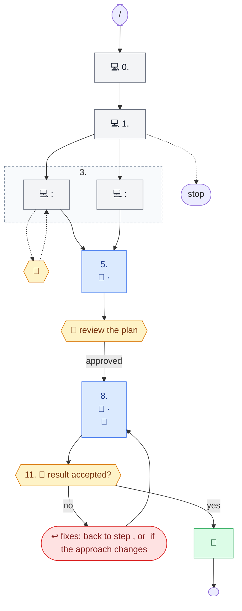

# Workflow document format

The exact shape of a workflow document. Copy the skeletons; replace only the `<…>` parts. The worked
example of this format is whichever workflow document the repository already has — read it once before writing a new
one.

## The emoji set

Four markers, nothing else. They replace the words they stand for: never write `<session>`, `[You]`,
"main session:" or "user:" next to them in the diagrams.

| Emoji | Meaning | Where it goes |
|---|---|---|
| 💻 | the main session, on whatever model it was started with | before every action the session itself performs |
| 🤖 | an agent call, always followed by `name (Model)` in the tree and `name · Model` in Mermaid | before the agent name |
| 🧩 | a skill | before the skill name |
| 🙋 | a point where the process waits for the user | before the question, decision or confirmation |

`↩` marks the return-to-implementation node in Mermaid. Do not add other emoji.

## Document skeleton

````markdown
# The <short name> workflow: `/<command> <argument>`

<One paragraph: what the command does end to end. If the workflow branches into lanes, name the selector
and every lane with its trigger, e.g. "The work item type selects the **lane**: `Bug` → Bug lane; … ; any
other type → stop.">

The body is `<path of the workflow body>`<, shared by both tools; `<wrapper 1>` (<tool>) and `<wrapper 2>`
(<tool>) are thin wrappers around it>. The diagram below shows who does what at each step. Legend:

- 💻 — the main session, on whatever model it was started with;
- agents have their model written out: it is set in `<agents folder>/*.md` and does not depend on the session's model;
- 🤖 — an agent call (`<agents folder>/`);
- 🧩 — a skill (`<skills folder>/`);
- 🙋 — a point where the process waits for the user.

```
<step tree — see below>
```

The same flow as a Mermaid diagram, without `/compact` and the
small commands, which are in the tree above. Grey blocks are the main session, blue are agents, green are
skills, yellow are waits for the user, red is a return to implementation.

```mermaid
<flowchart — see below>
```

The process waits for the user:

- <one bullet per group of waits, each ending with the step numbers in parentheses>;
- before each outward action: <list> (step N) — each needs its own "yes";
- <compaction / milestone waits, if the workflow has them>.

<Optional paragraph: who keeps which gates — only facts the workflow states (what agents never do, what
the session always does itself).>

<Optional paragraph: context economy — only if the workflow has such rules; one sentence listing them.>
````

Leave out an optional paragraph rather than filling it with anything the workflow does not say.

## Step tree (code block)

Box-drawing characters, one step per top-level branch, numbered exactly as the workflow numbers them
(merge adjacent steps as `6–7.` when the workflow treats them as one stage).

```
/<command> <example argument>
│
├─ 0. <Step title> ──────────────── 💻 <action>
│                                    <continuation of the same actor's work>
│                                    (<condition> → <outcome>)
├─ 1. <Step title> ──────────────── 💻 <action>
│
├─ 3. <Step with lanes>
│    ├─ <Lane A>: 💻 <action>
│    │          <continuation>
│    │          (<condition> → 🙋)
│    └─ <Lane B>: 💻 <action>
│               (<broad search> → 🤖 <agent>, <limit>)
│
├─ 5. <Step done by an agent> ───────────────▶ 🤖 <agent> (<Model>, <trait>)
│                                    (<alternative> → <what happens instead>)
│                                    ◀── <what the agent returns>
├─ 6. <Review step> ─────────────── 💻 <file it writes>
│                                    🙋 review → edits → review again
│
├─ 9. <Step with several actions>
│    ├─ 💻 <command>
│    │     <continuation aligned under the text after the emoji>
│    ├─ 💻 ──▶ 🤖 <agent> (<Model>) + 🧩 <skill> ◀── <result>
│    │    🙋 "yes, <action>" → 💻 <command>
│    └─ <failure> → back to <N>
│
└─ 14. <Last step> ──────────────── 🙋 "<question>?"
                                     yes → 💻 🧩 <skill> (<note>)
```

Rules:

- Pad the `──` run so the actor column lines up within a block of consecutive steps; a continuation line
  starts in the column of the emoji above it.
- Conditions and exceptions go in parentheses: `(<condition> → <outcome>)`.
- An agent call is `──▶ 🤖 name (Model)`; what it hands back is `◀── <result>`. A skill used by an agent
  call is appended with `+ 🧩 <skill>`.
- Quote the user's go-ahead as the workflow phrases it: `🙋 "yes, commit"`.
- Name concrete commands, files and paths only when the workflow names them; keep each line short.

## Mermaid flowchart



Rules:

- **Node kinds.** Session action `["💻 …"]:::session`; agent call `["…<br/>🤖 name · Model"]:::agent`;
  skill run by the session `["🧩 …"]:::skill`; user wait `{{"🙋 …"}}:::user` (hexagon); the single return
  node `(["↩ …"]):::fix`; start, stop and end are stadiums `([…])` with no class.
- **Edges.** The normal path is `-->`; a lane or answer label is `-- "label" -->`; an exceptional or
  optional path is dotted `-. "label" .->`, and its way back is `-.->`.
- **Groups.** A step that holds several nodes is a `subgraph STEPn["n. Title"]`, given the dashed `style`
  line at the end. Single-node steps need no subgraph.
- **Failures.** Every "back to step N" in the workflow becomes an edge into the one `FIX` node, labelled
  with the failure (`"red"`, `"failed item"`, `"no"`); `FIX` then points at the step it returns to.
- **Leave out** `/compact` milestones and small shell commands — they are in the tree.
- **Text.** Line breaks are `<br/>`; separators are ` · `; keep every label to three short lines; put
  every label in double quotes; never use a bare `"` inside a label.
- Copy the five `classDef` lines verbatim; add one `style STEPn …` line per subgraph.
