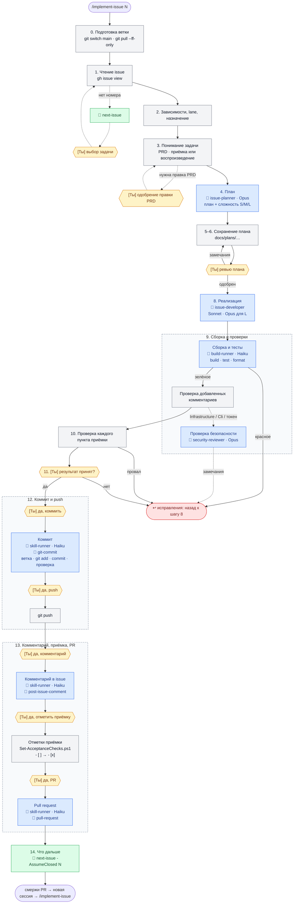

# AI Harness проекта GitHubBackup

Документ описывает окружение AI-ассистента (Claude Code), по которому ведётся разработка: из чего оно состоит, как устроен рабочий цикл задачи, почему выбраны те или иные модели и как перенести харнесс в другой проект.

Харнесс построен на основе харнесса проекта TimeTracker и адаптирован: GitHub вместо Azure DevOps, стек .NET 10 + WPF + CLI вместо Blazor, только Claude Code (без синхронизации с GitHub Copilot).

## Состав

```
CLAUDE.md                          главные инструкции, загружаются в каждую сессию
.mcp.json                          MCP-серверы проекта
.claude/
  settings.json                    разрешения, MCP, отключённая подпись в коммитах
  settings.local.json              личные настройки (не в git)
  commands/                        implement-issue, implement-issues, next-issue
  agents/                          issue-planner, issue-developer, build-runner, skill-runner, architect, security-reviewer
  rules/                           правила, которые подгружаются по путям файлов
  skills/                          _local.* (свои) и сторонние скиллы
.ai/
  prompts/implement-issue.md       тело рабочего цикла
  prompts/implement-issues.md      тело пакетного цикла (несколько задач, одна ветка)
  benchmarks/harness/              бенчмарк харнесса
docs/
  PRD.md                           требования (источник истины)
  plans/                           планы по issues
  ai-harness.md                    этот документ
```

Задел на будущую поддержку GitHub Copilot: тело рабочего цикла лежит отдельно от обёртки команды (`.ai/prompts/` и `.claude/commands/`), поэтому для Copilot достаточно добавить ещё одну тонкую обёртку. Скиллы в `.claude/skills/` и `CLAUDE.md` Copilot в VS Code тоже умеет читать (проверить при подключении).

## Языки

Файлы харнесса (`CLAUDE.md`, `.claude/**`, `.ai/**`) — на английском: они загружаются в контекст сессий, а кириллица занимает в 1,5–2,5 раза больше токенов. Заголовки issues, коммиты, PR и комментарии к ним — на английском (NFR-7). Документация в `docs/`, планы и тексты issues — на русском.

## Рабочий цикл задачи: `/implement-issue <n>`

Тело — `.ai/prompts/implement-issue.md`. Схема ниже показывает, кто что вызывает на каждом шаге. Обозначения:

- `<сессия>` — основная сессия на той модели, на которой она запущена (Opus, Sonnet и т. д.);
- у агентов модель указана явно: она задана в `.claude/agents/*.md` и от модели сессии не зависит (обоснование — в разделе [Агенты и модели](#агенты-и-модели));
- 🤖 — вызов агента (`.claude/agents/`);
- 🧩 — скилл (`.claude/skills/`);
- **[Ты]** — точка, где процесс ждёт пользователя.

```
/implement-issue 12
│
├─ 0. Подготовка ветки ───────────── <сессия>: git status → git switch main → git pull --ff-only
│                                    (есть незакоммиченные изменения → стоп, вопрос тебе)
├─ 1. Чтение issue ───────────────── <сессия>: gh issue view 12
│                                    (нет номера → 🧩 next-issue → [Ты] выбираешь)
├─ 2. Зависимости, lane, назначение ─ <сессия>: gh api graphql (blockedBy), метка bug/feature,
│                                    gh issue edit --add-assignee @me
│                                    (открытый блокер → стоп, вопрос тебе)
├─ 3. Понимание задачи ───────────── <сессия>: только связанные разделы PRD
│                                    Bug: падающий тест-воспроизведение
│                                    Feature: список приёмки
│                                    (нужна правка PRD → [Ты] одобряешь правку)
│
├─ 4. План ──────────────────────────────────▶ 🤖 issue-planner (Opus, только чтение)
│                                    ◀── план на русском + сложность S/M/L
├─ 5–6. Сохранение и ревью ───────── <сессия>: docs/plans/<type>-12-<slug>.md
│                                    [Ты] ревью → правки → снова ревью
├─ 7. План одобрен ───────────────── [Ты] /compact (готовая команда)
│
├─ 8. Реализация ────────────────────────────▶ 🤖 issue-developer
│                                    (Sonnet для S/M, Opus для L)
│                                    код + тесты, без коммитов
│                                    ◀── сводка изменений
├─ 9. Сборка и тесты
│    ├─ <сессия> ──1 вызов──▶ 🤖 build-runner (Haiku), scope full
│    │                         dotnet build -t:Rebuild
│    │                         dotnet test (вывод в файл)
│    │                         dotnet format --verify-no-changes
│    │    <сессия> ◀── дословные итоговые строки + первые ошибки
│    │    (красное → ошибки в 🤖 issue-developer → снова 🤖 build-runner)
│    ├─ <сессия>: проверка добавленных комментариев
│    ├─ если Infrastructure/Cli/токен: <сессия> ──▶ 🤖 security-reviewer (Opus)
│    │    <сессия> ◀── замечания → исправления
│    └─ [Ты] /compact
├─ 10. Проверка ──────────────────── <сессия>: каждый пункт приёмки → тест/команда/результат
│                                    (провал → назад к 8 или 4)
├─ 11. Подтверждение результата ──── [Ты] «результат принят?» → /compact
│
├─ 12. Коммит и push
│    ├─ <сессия>: git fetch; если main ушёл вперёд → git pull --ff-only и повтор шага 9 (🤖 build-runner)
│    ├─ <сессия>: отмечает чек-лист в плане
│    ├─ [Ты] «да, коммить»
│    │    <сессия> ──1 вызов──▶ 🤖 skill-runner (Haiku) + 🧩 git-commit
│    │                           создаёт ветку 12-<slug>
│    │                           git add <переданный список>
│    │                           пишет текст → git commit -F
│    │                           git log -1 → при ошибке --amend
│    │    <сессия> ◀── «a1b2c3d #12 Заголовок» ──┘
│    └─ [Ты] «да, push» → <сессия>: git push -u origin 12-<slug>
│
├─ 13. Комментарий, приёмка, PR
│    ├─ [Ты] «да, комментарий»
│    │    <сессия> ──1 вызов──▶ 🤖 skill-runner (Haiku) + 🧩 post-issue-comment
│    │                           текст → gh issue comment --body-file
│    │    <сессия> ◀── ссылка на комментарий
│    ├─ [Ты] «да, отметить приёмку» → <сессия>: Set-AcceptanceChecks.ps1 (- [ ] → - [x])
│    ├─ [Ты] «да, PR»
│    │    <сессия> ──1 вызов──▶ 🤖 skill-runner (Haiku) + 🧩 pull-request
│    │                           текст → gh pr create --body-file
│    │    <сессия> ◀── ссылка на PR
│    └─ <сессия>: gh pr checks (один раз, без опроса)
│
└─ 14. Что дальше ────────────────── <сессия>: 🧩 next-issue -AssumeClosed 12
                                     → «смержи PR → новая сессия → /implement-issue N»
```

Та же схема в виде диаграммы (GitHub рисует Mermaid сам), без `/compact` и мелких команд — они есть в текстовой схеме выше. Серые блоки — основная сессия, синие — агенты, зелёные — скиллы, жёлтые — ожидание пользователя, красный — возврат к реализации.



Остаться на текущей ветке вместо шага 0 можно, только явно сказав об этом: `/implement-issue 5 stay on current branch`.

Процесс ждёт пользователя:

- на ревью плана (шаги 5–6);
- на подтверждении результата (шаг 11);
- перед каждым действием наружу — коммит, push, комментарий, отметки приёмки, PR — нужно отдельное «да»;
- на трёх готовых командах `/compact` (шаги 7, 9, 11); их можно пропустить, пока переписка короткая.

Экономия контекста встроена в процесс: компактификация на трёх этапах с готовой командой `/compact keep: …`, ограничение на длину хода, «одна задача — одна сессия», узкое чтение, делегирование шумной работы агентам.

## Пакеты: `/implement-issues <n> <n> …`

Для небольших задач остановки на ревью плана каждой задачи стоят дороже самой работы. `/implement-issues 5 6 7` выполняет цикл `implement-issue` для каждой задачи в заданном порядке на **одной ветке** (`<первая>-<последняя>-<slug>`, создаётся на первом коммите, не раньше), по одному коммиту на задачу (`#<n> <заголовок>`), затем один раз проверяет ветку целиком и открывает **один PR**. Тело пакета не копирует цикл: оно ссылается на `implement-issue.md` и перечисляет только отличия, поэтому изменение цикла доходит и до пакета.

| Аспект | Поведение |
|---|---|
| Остановки | По умолчанию их нет. Пакет останавливается при нерешённом вопросе, необходимости изменить PRD, открытом блокирующем issue вне списка, закрытом issue, плане сложности `L`, невоспроизводимой ошибке, сбое, который не исправляют две попытки. `--review-plans` возвращает остановку на ревью плана |
| Спорные решения | Принимаются сами, записываются в раздел «Решения» плана и сводкой выдаются в конце |
| На каждую задачу | План, реализация, `build-runner` (полная пересборка и тесты затронутых проектов), коммит (запуск пакета разрешает коммиты) |
| Один раз в конце | `build-runner` с тестами всего решения и `dotnet format`, `security-reviewer` по диффу ветки (если затронуты Infrastructure, Cli, путь токена, процессы, архивы или пакеты); исправления — дополнительными коммитами под номером своей задачи |
| Выдача | Одно подтверждение результата; затем push, PR и комментарии — каждое после «да» пользователя либо без вопросов с `--ship`. В PR по строке `Closes #<n>` на задачу |
| Ограничения | Не больше 5 задач сложности S или M; коммиты пакета не переписываются |

Рядом действует правило из `CLAUDE.md`: ветки не создаются, не переключаются, не переименовываются и не удаляются, а `git stash` не вызывается без просьбы пользователя; исключение — ветка задачи, создаваемая вместе с разрешённым коммитом.

## Порядок задач: `/next-issue`

Зависимости между issues хранятся дважды: связи GitHub «Blocked by» (для машины) и раздел `## Зависимости` в тексте issue (для человека). При создании issue заполняются оба.

Скрипт `.claude/skills/_local.next-issue/scripts/Get-NextIssue.ps1` одним GraphQL-запросом получает открытые issues и выбирает готовые: без открытого PR и со всеми закрытыми блокирующими задачами. Порядок — по F-коду в заголовке (фаза, затем номер). Параметр `-AssumeClosed <n>` считает задачу закрытой: так `implement-issue` рекомендует следующую задачу до merge текущего PR.

## Агенты и модели

| Агент | Модель | Назначение и причина выбора модели |
|---|---|---|
| `issue-planner` | Opus | Только чтение, возвращает план. Ошибка плана стоит дороже всего, а объём вывода мал |
| `issue-developer` | Sonnet по умолчанию, Opus для сложности L | Самый «дорогой» по токенам агент (чтение, сборки, итерации); по согласованному детальному плану Sonnet обычно достаточно |
| `build-runner` | Haiku | Шлюз сборки на шаге 9: полная пересборка, тесты, `dotnet format --verify-no-changes`. Возвращает дословные итоговые строки инструментов и первые ошибки, поэтому пересказ не может исказить результат. Основная сессия тратит на шлюз один вызов вместо 4–6, а шумный вывод сборки не попадает в её контекст. Проверяет независимо от `issue-developer`, ничего не исправляет |
| `skill-runner` | Haiku | Выполняет одно уже подтверждённое действие целиком по скиллу: коммит (`git-commit`), комментарий в issue (`post-issue-comment`) или PR (`pull-request`) — пишет текст на английском, запускает команду `git`/`gh`, проверяет результат. Основная сессия тратит на действие один вызов и не загружает скилл в свой контекст. Push, правку тела issue и merge агент не делает |
| `architect` | Opus | Проектные вопросы: границы слоёв, отказоустойчивость, отмена |
| `security-reviewer` | Opus | Риски приложения: утечка токена, инъекция аргументов git, выход за пределы папок, архивы |

Черновые папки и файлы, которые основная сессия передаёт `build-runner` и `skill-runner`, лежат вне репозитория, а оба агента запускают одну простую команду за вызов: так в `git status` не попадает ничего лишнего, а каждая команда подходит под правила разрешений. Скиллы `git-commit`, `post-issue-comment` и `pull-request` удаляют свой черновой файл после успешного действия — кто бы их ни выполнял, основная сессия или `skill-runner`; `build-runner` сам удаляет свои файлы вывода, когда всё зелёное, и оставляет их при ошибке. Эти вызовы `rm` не внесены в список разрешённых: шаблон пути, широкий настолько, чтобы покрыть временную папку любого пользователя, совпал бы и со вторым, репозиторным путём в той же команде, поэтому вне автоматического режима каждое удаление спрашивает подтверждение один раз.

Цены за 1M токенов (вход/выход) на момент настройки: Opus 5.5 — $4/$20, Sonnet 5.5 — $2/$10, Haiku 4.5 — $1/$5, Fable 5.1 — $10/$50. По замерам TimeTracker около 88% затрат приходится на основную сессию с растущим контекстом, поэтому дисциплина контекста важнее выбора модели субагента.

Ревью кода — встроенные `/code-review` и `/security-review`; они читают правила проекта.

## Правила (`.claude/rules/`)

Правило подгружается в контекст, когда ассистент читает файл, подходящий под его `paths`.

| Правило | Пути | Содержание |
|---|---|---|
| `csharp.md` | `**/*.cs` | Слои, DI и options, TimeProvider и IFileSystem, async и отмена, ошибки, логирование, гигиена комментариев, стиль C# 14 |
| `tests.md` | тестовые проекты | Слои тестов, xUnit v3, Shouldly, NSubstitute, Verify, WireMock, FlaUI, детерминированность |
| `wpf-mvvm.md` | `GitHubBackup.App/**`, `*.xaml` | MVVM на CommunityToolkit.Mvvm, команды с отменой, виртуализация, AutomationId |
| `cli.md` | `GitHubBackup.Cli/**` | System.CommandLine, Spectre.Console, коды возврата, `--silent`, `--dry-run` |
| `external-processes.md` | `GitHubBackup.Infrastructure/**` | Запуск git и 7-Zip, передача токена через окружение, коды возврата, логирование вывода, отмена |
| `security.md` | все основные проекты | Каталог рисков с идентификаторами S/I/F/P/D и уровнями серьёзности |
| `msbuild.md` | `*.csproj`, `Directory.*.props`, `.slnx` | Общие свойства, Central Package Management, ссылки по слоям |
| `github-actions.md` | `.github/workflows/**` | Закреплённые версии actions, минимальные права, секреты, кэш |
| `update-docs-on-code-change.md` | CLI, настройки, файлы харнесса | Какой документ обновлять при каком изменении; PRD-first |
| `docs.md` | `docs/**`, `README.md` | Русский язык, правила правки PRD, формат планов |

## Скиллы (`.claude/skills/`)

Свои (`_local.*`):

| Скилл | Назначение |
|---|---|
| `_local.git-commit` | Ветки `<n>-<slug>`, формат коммита `#<n> <title>` + пункты, без подписи |
| `_local.pull-request` | PR в `main`, `Closes #<n>`, содержание описания, однократная проверка CI |
| `_local.post-issue-comment` | Комментарий в issue: RCA для бага, итоги реализации для остальных. Скрипт `Set-AcceptanceChecks.ps1` одним вызовом отмечает проверенные пункты `## Критерии приёмки` по их номерам; остальной текст issue он не меняет и отказывается писать, если изменилось бы что-то кроме отметок |
| `_local.write-tests` | Выбор слоя тестов, регрессионный тест сначала для бага |
| `_local.debug-issue` | Воспроизведение, разбор логов, поиск причины |
| `_local.refactor-code` | Рефакторинг без изменения поведения |
| `_local.nuget-package-update` | Обновление пакетов по семействам с проверкой сборкой и тестами |
| `_local.next-issue` | Рекомендация следующей задачи |
| `_local.harness-quality-check` | Бенчмарк харнесса (только ручной запуск) |

Сторонние (скопированы как есть, лицензия MIT; при обновлении — заменить папку целиком):

| Скилл | Источник |
|---|---|
| `mvvm-toolkit`, `mvvm-toolkit-di`, `mvvm-toolkit-messenger`, `system-commandline-cli` | [github/awesome-copilot](https://github.com/github/awesome-copilot/tree/main/skills) |
| `run-tests`, `test-anti-patterns`, `coverage-analysis` | [dotnet/skills](https://github.com/dotnet/skills), плагин `dotnet-test` |
| `directory-build-organization` | [dotnet/skills](https://github.com/dotnet/skills), плагин `dotnet-msbuild` |
| `dotnet-pinvoke` | [dotnet/skills](https://github.com/dotnet/skills), плагин `dotnet-advanced` (для Credential Manager) |
| `csharp-async`, `csharp-docs`, `ef-core`, `microsoft-docs` | из харнесса TimeTracker (исходно github/awesome-copilot) |

Правила `wpf-mvvm.md` и `github-actions.md` основаны на инструкциях `dotnet-wpf`, `mvvm-toolkit` и `github-actions-ci-cd-best-practices` из github/awesome-copilot.

## MCP-серверы (`.mcp.json`)

| Сервер | Назначение |
|---|---|
| `context7` | Документация сторонних библиотек (Octokit, Serilog, Spectre.Console, Verify, WireMock…) |
| `microsoft-learn` | Официальная документация Microsoft (.NET, WPF, System.CommandLine, EF Core, MSBuild) |
| `nuget` | Версии, уязвимости и сведения о пакетах NuGet; запускается через `dnx` из .NET 10 SDK |

Не подключены сознательно: GitHub MCP (всё нужное делает `gh` без дополнительного токена и без десятков инструментов в контексте), Playwright (только браузер, для WPF бесполезен), Figma. MCP для автоматизации WPF выбирается в #49.

## Разрешения (`.claude/settings.json`)

- Без вопросов: сборка, тесты, `dotnet format`, чтение через git и `gh`, инструменты MCP-серверов, скрипты скиллов `_local.*`, `gh api graphql`, локальные `git add`, `git switch`, `git pull --ff-only`, а также `git commit`, `git push`, `gh issue comment`, `gh issue edit`, `gh pr create`. Для последних пяти подтверждение даёт пользователь в чате: шлюзы процесса `implement-issue` требуют явного «да» перед каждым из этих действий, поэтому системный запрос не дублирует его. То же относится к скрипту `Set-AcceptanceChecks.ps1`: он запускается без системного запроса, как все скрипты `_local.*`, но правит тело issue и потому вызывается только после «да» пользователя.
- С системным вопросом: `gh pr merge`, `gh pr comment`, `gh pr edit`, `gh issue create`, `gh issue close`, REST-вызовы `gh api` (`repos/…`, `-X`, `--method`) — действия, которые трудно отменить или которые меняют чужие данные.
- Запрещено: `git push --force`, `git reset --hard`, `git clean`, `rm -rf`, чтение `.env`.
- Подпись `Co-Authored-By` в коммитах и PR отключена.
- Правило «спрашивать» сильнее правила «разрешено», поэтому разрешение для узкого шаблона не работает, если более широкий шаблон стоит в «спрашивать».
- Составные команды (`cd … &&`, конвейеры, циклы) нельзя разрешить навсегда, поэтому `CLAUDE.md` требует простых команд из корня репозитория.
- Разрешения меняет только пользователь: правку `.claude/settings.json` ассистентом автоматический режим блокирует как самоизменение прав.

## Бенчмарк харнесса

Скилл `_local.harness-quality-check` запускает фиксированные тестовые сессии (`claude -p`) и записывает метрики: контекст в начале, токены от чтения файла, загруженные правила, оценку судьи по эталону. История — `.ai/benchmarks/harness/run-history.csv`, отчёты — `.ai/benchmarks/harness/reports/`. Запускать после изменения `CLAUDE.md`, правил, скиллов, агентов, MCP или настроек.

Сейчас фикстуры: `bench-base` (стартовый контекст) и `quality-prd-first` (соблюдение правила PRD-first). Фикстуры, которым нужен код, — в отложенных задачах.

## Отложенные задачи

| Issue | Когда | Что |
|---|---|---|
| [#46](https://github.com/askrinnik/GitHubBackup/issues/46) F0.7 | после #2 | Хуки Claude Code: форматирование и сборка после правок |
| [#47](https://github.com/askrinnik/GitHubBackup/issues/47) F1.13 | после #10, #13 | Фикстуры для кода: `bench-cs`, `bench-test`, `quality-service-convention`, `quality-security` |
| [#48](https://github.com/askrinnik/GitHubBackup/issues/48) F3.11 | после #26 | Фикстура `quality-docs-sync` |
| [#49](https://github.com/askrinnik/GitHubBackup/issues/49) F4.8 | после #36, до #37 | MCP для автоматизации WPF, фикстура `bench-xaml` |

## Перенос в другой проект

Без изменений переносятся:
- механизм `implement-issue` (шаги, контрольные точки, экономия контекста);
- агенты `issue-planner`, `issue-developer`, `skill-runner`, а `build-runner` — с заменой команд сборки (см. ниже);
- скиллы `_local.git-commit`, `_local.pull-request`, `_local.post-issue-comment`, `_local.next-issue` — для любого репозитория на GitHub;
- гигиена комментариев (`csharp.md`);
- бенчмарк (`_local.harness-quality-check` и `bench-base`).

Нужно переписать под проект:
- `CLAUDE.md`;
- команды сборки, тестов и формата в агенте `build-runner`;
- правила по стеку (`wpf-mvvm.md`, `cli.md`, `external-processes.md`, `security.md`, раздел «GitHubBackup patterns» в `csharp.md`);
- семейства пакетов в `_local.nuget-package-update`;
- эталоны фикстур `quality-*`.

Условия для переноса: PRD-документ с идентификаторами требований, issues с разделами «Источник требований», «Критерии приёмки» и «Зависимости», F-коды в заголовках и связи «Blocked by».

## Сопровождение

При изменении `CLAUDE.md`, `.claude/**`, `.ai/**` или `.mcp.json` этот документ обновляется в том же изменении (правило `update-docs-on-code-change.md`), после чего желательно запустить бенчмарк.
