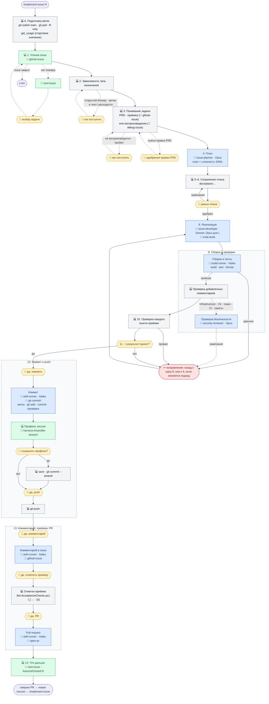

# Рабочий цикл задачи: `/implement-issue 12`

Одна команда ведёт задачу GitHub от чтения до pull request: читает issue, проверяет зависимости и PRD, планирует, реализует с тестами, проверяет, фиксирует результат в issue, открывает PR и рекомендует следующую задачу. Метки issue выбирают **lane**: метка `bug` → Bug lane (воспроизвести, исправить причину, комментарий с анализом причины); только тесты для уже существующего поведения (обычно `type:test`) → Test-authoring lane (без продакшн-кода, тесты — результат задачи); остальное (`type:feature`, `type:chore`) → Feature lane (список приёмки, план, сборка, комментарий о реализации). Изменение CI, конфигурации или документации идёт по Feature lane, даже с меткой `type:test`. Две контрольные точки с пользователем — ревью плана и подтверждение результата; каждое действие наружу (коммит, push, комментарий, PR) требует отдельного «да».

Тело цикла — `.ai/prompts/implement-issue.md`; `.claude/commands/implement-issue.md` — тонкая обёртка вокруг него. Схема ниже показывает, кто что делает на каждом шаге. Обозначения:

- 💻 — основная сессия на той модели, на которой она запущена;
- у агентов модель указана явно: она задана в `.claude/agents/*.md` и от модели сессии не зависит (обоснование — в разделе [Агенты и модели](README.md#агенты-и-модели));
- 🤖 — вызов агента (`.claude/agents/`);
- 🧩 — скилл (`.claude/skills/`);
- 🙋 — точка, где процесс ждёт пользователя.

```
/implement-issue 12
│
├─ 0. Подготовка ветки ───────────── 💻 git status → git switch main → git pull --ff-only
│                                    (есть незакоммиченные изменения → стоп, 🙋)
│                                    (остаться на текущей ветке — только если пользователь
│                                     так сказал)
│                                    get_usage молча — стартовое значение лимита для профиля
│                                    (нет инструмента → пропуск)
├─ 1. Чтение issue ───────────────── 💻 🧩 github-issue (тело, комментарии, подзадачи)
│                                    (нет номера → 🧩 next-issue → 🙋 выбор задачи)
│                                    (issue закрыт → стоп)
├─ 2. Зависимости, lane, назначение ─ 💻 gh api graphql (blockedBy), метка bug → Bug,
│                                    только тесты → Test-authoring, иначе Feature,
│                                    gh issue edit --add-assignee @me
│                                    (открытый блокер → стоп, 🙋)
│                                    (метки и текст расходятся → 🙋)
│
├─ 3. Понимание задачи ───────────── 💻 читает только связанные разделы PRD
│    ├─ Bug: 🧩 debug-issue → падающий тест-воспроизведение
│    │          (не воспроизводится → 🙋)
│    ├─ Feature / Test-authoring: 🧩 github-issue → список приёмки
│    │          (существенный пробел → 🙋)
│    └─ (задача требует поведения вне PRD → 🙋 одобрение правки PRD)
│
├─ 4. План ──────────────────────────────────▶ 🤖 issue-planner (Opus, только чтение)
│                                    (сверка покрытия с кодом: входы, ветки, границы)
│                                    ◀── план на русском + сложность S/M/L
├─ 5–6. Сохранение и ревью ───────── 💻 docs/plans/<type>-12-<slug>.md
│                                    🙋 ревью → правки → снова ревью
├─ 7. План одобрен ───────────────── 💻 решения ревью → в план
│                                    🙋 /compact (готовая команда)
│
├─ 8. Реализация ────────────────────────────▶ 🤖 issue-developer (Sonnet · Opus для L)
│                                    тесты через 🧩 write-tests · документация в том же изменении
│                                    ◀── сводка изменений (без коммитов)
│                                    (Test-authoring: тесты нашли сломанное поведение → стоп, 🙋)
│
├─ 9. Сборка и тесты
│    ├─ 💻 ──1 вызов──▶ 🤖 build-runner (Haiku), scope full
│    │                   dotnet build -t:Rebuild
│    │                   dotnet test (вывод в файл)
│    │                   dotnet format --verify-no-changes
│    │    💻 ◀── дословные итоговые строки + первые ошибки
│    │    (красное → ошибки в 🤖 issue-developer → снова 🤖 build-runner)
│    ├─ 💻 проверка добавленных комментариев
│    ├─ если Infrastructure / Cli / путь токена / CI-workflow / пакеты:
│    │    💻 ──▶ 🤖 security-reviewer (Opus) ◀── замечания → исправления
│    ├─ (build-runner и сработавшее ревью пропускаются только по прямому слову пользователя)
│    └─ 🙋 /compact
├─ 10. Проверка ──────────────────── 💻 каждый пункт приёмки → тест / команда / результат
│                                    (пункт без поведения во время работы — CI, конфигурация,
│                                     документация — командой или CI в PR; пункт, который
│                                     подтверждает только CI, остаётся открытым до прогона)
│                                    (Test-authoring: новые тесты есть в сводке build-runner,
│                                     проходят и проверяют нужное поведение)
│                                    (провал → назад к 8, или к 4, если меняется подход)
│                                    (пропуск — только по прямому слову пользователя)
├─ 11. Подтверждение результата ──── 💻 таблица: пункт → как проверен → результат (или RCA)
│                                    🙋 «результат принят?» → /compact
│                                    (не принят → назад к 8 или 4)
│
├─ 12. Коммит и push
│    ├─ 💻 git fetch; main ушёл вперёд → git pull --ff-only и повтор шага 9 (🤖 build-runner)
│    ├─ 💻 отмечает чек-лист в плане и задачу в docs/plans/*-plan.md, если она есть
│    ├─ 🙋 «да, коммить»
│    │    💻 ──1 вызов──▶ 🤖 skill-runner (Haiku) + 🧩 git-commit
│    │                     создаёт ветку 12-<slug> от свежего main
│    │                     git add <переданный список>
│    │                     пишет текст → git commit -F
│    │    💻 ◀── «a1b2c3d #12 Заголовок»
│    ├─ 💻 🧩 harness-kit:profile-session (только в основной сессии; нет скилла → одна строка, пропуск)
│    │    итог в нескольких строках: вызовы, единицы стоимости, активности, лимит
│    │    🙋 «сохранить профиль и добавить в коммит?»
│    │    да → save -WorkItem 12 -NoCommit → git add записи → git commit --amend
│    │         (коммит уже запушен → новый коммит: 🤖 skill-runner + 🧩 git-commit)
│    └─ 🙋 «да, push» → 💻 git push -u origin 12-<slug>
│
├─ 13. Комментарий, приёмка, PR
│    ├─ 🙋 «да, комментарий»
│    │    💻 ──1 вызов──▶ 🤖 skill-runner (Haiku) + 🧩 github-issue
│    │                     текст → gh issue comment --body-file
│    │    💻 ◀── ссылка на комментарий
│    ├─ 🙋 «да, отметить приёмку» → 💻 Set-AcceptanceChecks.ps1 (- [ ] → - [x])
│    ├─ 🙋 «да, PR»
│    │    💻 ──1 вызов──▶ 🤖 skill-runner (Haiku) + 🧩 open-pr
│    │                     текст → gh pr create --body-file
│    │    💻 ◀── ссылка на PR
│    └─ 💻 gh pr checks (один раз, без опроса; упала проверка → исправление на той же ветке после «да»)
│
└─ 14. Что дальше ────────────────── 💻 🧩 next-issue -AssumeClosed 12
                                     → «смержи PR → новая сессия → /implement-issue N»
```

Та же схема в виде диаграммы (GitHub рисует Mermaid сам), без `/compact` и мелких команд — они есть в текстовой схеме выше. Серые блоки — основная сессия, синие — агенты, зелёные — скиллы, жёлтые — ожидание пользователя, красный — возврат к реализации.



Процесс ждёт пользователя:

- при незакоммиченных изменениях, выборе задачи (если номер не указан), открытом блокере, расхождении меток и текста, невоспроизводимой ошибке, существенном пробеле в требованиях и правке PRD (шаги 0–3); закрытый issue останавливает процесс;
- на ревью плана (шаги 5–6);
- на подтверждении результата (шаг 11);
- перед каждым действием наружу — коммит, push, комментарий, отметки приёмки, PR (шаги 12–13) — нужно отдельное «да»;
- на вопросе, сохранить ли профиль сессии и добавить ли запись в коммит (шаг 12, между коммитом и push);
- на трёх готовых командах `/compact` (после шагов 7, 9 и 11); их можно пропустить, пока переписка короткая.

Все ворота остаются у основной сессии: `issue-developer` не коммитит, не делает push и ничего не публикует, а `skill-runner` выполняет одно уже подтверждённое действие и не делает push. «Прошло» от `issue-developer` — это вход, а не доказательство: сборка и тесты заново запускаются в `build-runner`.

Экономия контекста встроена в процесс: три `/compact` с готовым текстом, ограничение на длину хода, «одна задача — одна сессия», узкое чтение, маленький вывод инструментов, делегирование шумной работы агентам и черновые файлы вне репозитория.

Стоимость сессии измеряет скилл `harness-kit:profile-session` из плагина `harness-kit` (не из `.claude/skills/`): шаг 0 молча снимает стартовое значение недельного лимита, шаг 12 после коммита строит профиль по транскрипту сессии. Push, комментарий и PR идут после профиля и в него не входят. Подробнее — в разделе [Профиль реальных сессий](README.md#профиль-реальных-сессий).

Несколько небольших задач на одной ветке описаны в [implement-issues](implement-issues.md).
