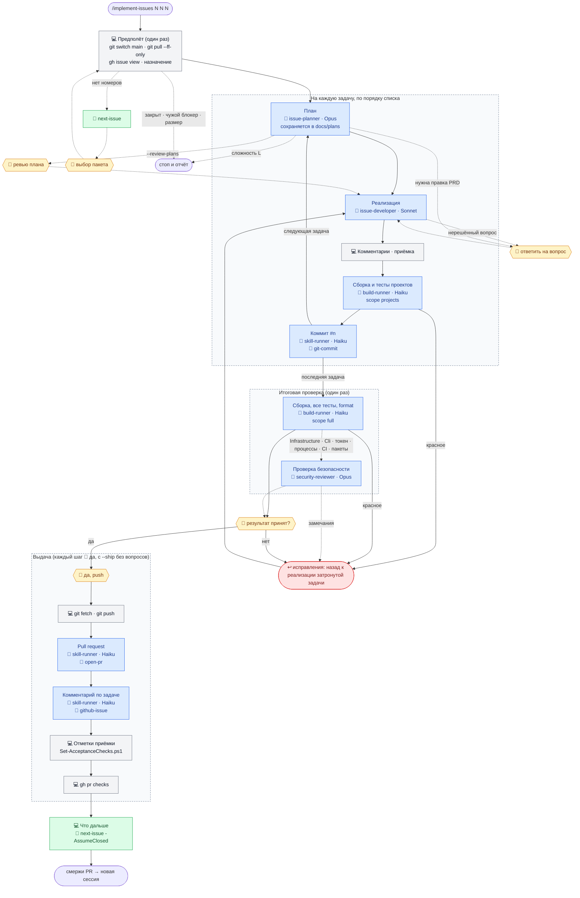

# Пакетный цикл: `/implement-issues 5 6 7`

Для небольших задач остановки на ревью плана каждой задачи стоят дороже самой работы. Команда выполняет цикл [`/implement-issue`](implement-issue.md) для каждой задачи в заданном порядке на **одной ветке** (`<первая>-<последняя>-<slug>`, создаётся на первом коммите, не раньше), по одному коммиту на задачу (`#<n> <заголовок>`), затем один раз проверяет ветку целиком и открывает **один PR**. Необязательные флаги: `--review-plans` возвращает остановку на ревью плана каждой задачи; `--ship` заранее разрешает push, PR, комментарии в issues и отметки приёмки. Без номеров команда рекомендует пакет через скилл `next-issue`.

Тело — `.ai/prompts/implement-issues.md`; `.claude/commands/implement-issues.md` — тонкая обёртка вокруг него. Тело не копирует цикл `implement-issue`: оно ссылается на него и перечисляет только отличия, поэтому изменение цикла доходит и до пакета. Обозначения:

- 💻 — основная сессия на той модели, на которой она запущена;
- у агентов модель указана явно: она задана в `.claude/agents/*.md` и от модели сессии не зависит (см. [Агенты и модели](README.md#агенты-и-модели));
- 🤖 — вызов агента (`.claude/agents/`);
- 🧩 — скилл (`.claude/skills/`);
- 🙋 — точка, где процесс ждёт пользователя.

```
/implement-issues 5 6 7 [--review-plans] [--ship]
│
├─ Предполёт (один раз) ──────────── 💻 git status → git switch main → git pull --ff-only
│                                    (есть незакоммиченные изменения → стоп)
│                                    (нет номеров → 🧩 next-issue → 🙋 выбор пакета)
│                                    gh issue view по каждой задаче, lane — по меткам
│                                    (issue закрыт → стоп)
│                                    (открытый блокер не раньше в списке → стоп)
│                                    (лимит: 5 задач сложности S или M)
│                                    gh issue edit --add-assignee @me
│
├─ На каждую задачу, по порядку списка
│    ├─ 💻 ──▶ 🤖 issue-planner (Opus, только чтение) ◀── план + сложность S/M/L
│    │          (L → стоп; план сохраняется и работа идёт дальше)
│    │          (--review-plans → 🙋 ревью плана)
│    │          (нужна правка PRD → стоп, 🙋 одобрение)
│    ├─ 💻 ──▶ 🤖 issue-developer (Sonnet) ◀── сводка изменений (без коммитов)
│    │          (нерешённый вопрос → стоп, 🙋; спорный выбор → в «Решения» плана
│    │           и в общий список, без остановки)
│    ├─ 💻 проверка добавленных комментариев; проверка по пунктам приёмки (шаг 10)
│    ├─ 💻 ──1 вызов──▶ 🤖 build-runner (Haiku), scope projects (затронутые тест-проекты)
│    │          (красное → назад к реализации; красные коммиты запрещены)
│    └─ 💻 ──1 вызов──▶ 🤖 skill-runner (Haiku) + 🧩 git-commit
│               первый коммит создаёт ветку <первая>-<последняя>-<slug>
│               в коммит входят план и отметка задачи в docs/plans/*-plan.md, если она есть
│               ◀── «a1b2c3d #5 Заголовок»
│
├─ Итоговая проверка (один раз) ──── по git diff main...HEAD
│    ├─ 💻 ──1 вызов──▶ 🤖 build-runner (Haiku), scope full
│    │                   (UI-тесты входят в прогон; для GitHubBackup.App — убедиться, что
│    │                    GitHubBackup.App.UITests есть в итоге)
│    ├─ если Infrastructure / Cli / путь токена / процессы или архивы / CI / пакеты:
│    │    💻 ──▶ 🤖 security-reviewer (Opus) ◀── замечания
│    ├─ 💻 повторная проверка пунктов приёмки, которые мог затронуть итоговый прогон
│    └─ падение или замечание → исправление отдельным коммитом под номером своей задачи,
│       затем повтор затронутых проверок
│
├─ Отчёт и подтверждение ─────────── 💻 таблица: задача → коммит → приёмка → проверка → результат
│                                    💻 список спорных решений, что не охвачено
│                                    🙋 «результат принят?» (нет → правка задачи, повторная проверка)
│
├─ Выдача (каждый шаг — 🙋 «да», с --ship — без вопросов)
│    ├─ 💻 git fetch; main ушёл вперёд → git pull --ff-only и повтор итоговой проверки
│    ├─ 💻 git push -u origin <ветка>
│    ├─ 💻 ──1 вызов──▶ 🤖 skill-runner (Haiku) + 🧩 open-pr: один PR, по строке «Closes #<n>» на задачу
│    ├─ 💻 ──1 вызов на задачу──▶ 🤖 skill-runner (Haiku) + 🧩 github-issue: комментарий со ссылкой на PR
│    │    💻 Set-AcceptanceChecks.ps1 по каждой задаче (- [ ] → - [x])
│    └─ 💻 gh pr checks (один раз, без опроса)
│
└─ Что дальше ────────────────────── 💻 🧩 next-issue -AssumeClosed <все задачи пакета>
                                     → «смержи PR → новая сессия → /implement-issue(s)»
```

Та же схема в виде диаграммы, без мелких команд — они есть в текстовой схеме выше. Серые блоки — основная сессия, синие — агенты, зелёные — скиллы, жёлтые — ожидание пользователя, красный — возврат к реализации.



Пакет останавливается и докладывает, оставляя все готовые коммиты на месте, при: нерешённом вопросе, правке PRD, ждущей одобрения, чужом открытом блокере, закрытом issue, плане сложности `L`, невоспроизводимой ошибке (Bug lane), сбое сборки или тестов, который не исправляют две попытки, и изменении, которое пришлось бы вносить в коммит более ранней задачи не простым продолжением. Коммиты пакета не переписываются: исправления идут вперёд.

Процесс ждёт пользователя:

- при незакоммиченных изменениях, выборе пакета (если номера не указаны), нерешённом вопросе или правке PRD (предполёт и работа над задачами);
- на ревью плана каждой задачи — только с `--review-plans`;
- на подтверждении результата всего пакета;
- перед каждым действием наружу — push, PR, комментарии в issues и отметки приёмки — нужно отдельное «да», если `--ship` не разрешил их заранее. Запуск пакета разрешает коммиты — по одному на задачу.

Спорные решения принимаются сами, записываются в раздел «Решения» плана каждой задачи и сводкой выдаются в конце. В пакет входит не больше 5 задач сложности S или M.
